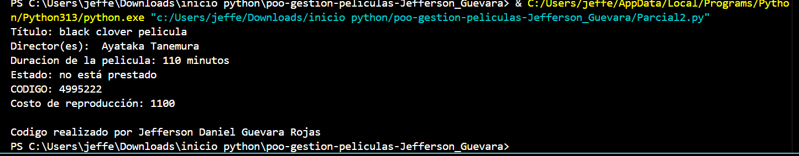

Este codigo le permite mostrar al usuario la informacion de una pelicula ya determinada por el Autor del codigo, en el cual le indican nombre, duracion en minutos y un codigo respectivo para la pelicula ademas de esto se muestra el costo por repoduccion el cual se basa en multiplicar la duracion por, en este caso, 10 que seria el costo; a la hora de ejecutarlo dandole al simbolo de play ubicada en la parte superior derecha se mostrara la informacion mencionada.

Autor: 
Nombre: Jefferson Daniel Guevara Rojas 
Correo: jefferson.guevara@uniminuto.edu.co
NRC: 10-74169

